# Software Architecture Design

## 🏗️ System Architecture Overview

```mermaid
graph TB
    %% AWS Cloud Components
    AWS[🏢 AWS Cloud] --> CloudTrail[📊 CloudTrail Logs]
    AWS --> IAM[🔐 IAM Service]

    %% Core Processing Engine
    CloudTrail --> Boto3[🔄 Boto3 Client]
    IAM --> Boto3
    Boto3 --> Pandas[📊 Pandas Processor]
    Pandas --> Analyzer[🔍 Security Analyzer]

    %% Presentation Layer
    Analyzer --> Streamlit[🎯 Streamlit Dashboard]
    Analyzer --> Alerts[🚨 Alert Engine]

    %% Output Channels
    Streamlit --> User[👤 End User]
    Alerts --> Email[📧 Email SMTP]
    Alerts --> Slack[💬 Slack Webhook]
    Alerts --> SNS[📱 AWS SNS]

    %% Styling for clarity
    classDef aws fill:#FF9900,color:#000
    classDef processing fill:#3776AB,color:#fff
    classDef output fill:#FF4B4B,color:#fff
    classDef notification fill:#00C853,color:#000

    class AWS,CloudTrail,IAM aws
    class Boto3,Pandas,Analyzer processing
    class Streamlit,User output
    class Alerts,Email,Slack,SNS notification
```

## 🎯 Design Principles

### 1. Simplicity & Understandability ✅
- **Linear Data Flow**: Clear, predictable data pipeline from source to visualization
- **Explicit Naming**: Each component's purpose is immediately understandable  
- **Minimalist Approach**: Only essential components included to reduce complexity

### 2. Single Responsibility Principle ✅
Each component has one clear responsibility:

| Component | Responsibility |
|-----------|----------------|
| **Boto3 Client** | Connect to AWS and retrieve security logs |
| **Pandas Processor** | Clean, structure, and prepare data for analysis |
| **Security Analyzer** | Apply threat detection rules and identify risks |
| **Streamlit Dashboard** | Visualize security insights for users |
| **Alert Engine** | Manage notifications and threat escalations |

### 3. Performance & Latency Optimization ✅
- **Incremental Loading**: Process logs in batches to manage memory
- **Smart Caching**: Reuse frequently accessed data
- **Vectorized Operations**: Leverage Pandas for efficient data processing
- **Lazy Loading**: Load components only when needed

### 4. Maintainability & Evolvability ✅
- **Modular Architecture**: Independent components with clear interfaces
- **Testable Design**: Each component can be tested in isolation
- **Documentation-First**: Clear APIs and usage patterns
- **Extension-Friendly**: Easy to add new cloud providers or detection rules

## 🔧 Core Components & Responsibilities

### **Cloud Layer** → **Data Collection**
- **AWS Connector**: Authenticates and retrieves CloudTrail logs
- **IAM Service**: Manages secure access permissions  
- **Data Output**: Raw JSON logs for processing

### **Processing Layer** → **Data Analysis**
- **Data Processor**: Cleans and structures raw log data
- **Security Engine**: Applies detection rules and identifies threats
- **Analysis Output**: Structured security findings and metrics

### **Presentation Layer** → **User Interface**
- **Streamlit Dashboard**: Interactive web interface for security monitoring
- **Visualization Engine**: Charts, metrics, and data tables
- **User Experience**: Real-time security insights

### **Alerting Layer** → **Notifications**
- **Alert Engine**: Evaluates security thresholds and conditions
- **Multi-Channel Notifier**: Supports email, Slack, and SMS notifications
- **Critical Event Handler**: Manages urgent security incidents

  

