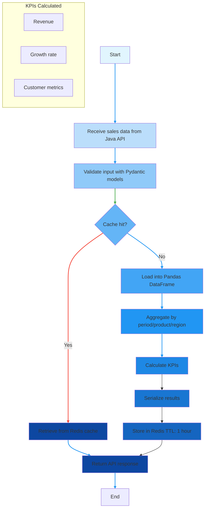

# Python/Data & DevSecOps Engineer — SalesFlow Lite
### Microservices • Security by Design • Automation • Analytics & ML (FastAPI + Spring Boot)

---

## 1) Authentic introduction (problem, collaboration, my role)

**Business problem:**  
Small businesses often operate with basic POS workflows but lack **sales visibility**, **analytics**, and **decision-support** (forecasting + anomaly detection). SalesFlow Lite addresses this gap by adding analytics/reporting/ML as a dedicated service layer.

**Collaboration note (transparent):**  
- **Java/Spring Boot backend** (core business logic + auth) was implemented with a partner.  
- **React frontend** was shared.  
- **My central ownership:** the **Python/FastAPI microservice** (Data + Automation + Security integration) and the **Ops-ready architecture choices** for a local-production MVP. 

---

## 2) Contributions — 4 pillars

---

## 🔹 Pillar A — Data & Machine Learning

### What I built
- **FastAPI analytics + ML APIs** under `/api/v1/*` (analytics, ml, excel, reports).   
- **Pandas-based processing**: normalization, aggregation, time-series preparation (KPIs, daily totals, trend computation).   
- **Forecasting (decision support)** with fallback logic:
  - Linear Regression (default)
- **Anomaly detection**:
  - Z-score (simple + effective)
  - Severity labeling + human-readable explanations. 

### Concrete examples (from session reports)
- Forecast endpoint provides **trend** (`upward|downward|stable`) and summary KPIs (`total`, `daily_average`, `peak_value`, `peak_day`).   
- Z-score anomalies: `abs(z) >= 2` with severity **medium (2–3)** and **high (>=3)** plus labels like `ZERO_DROP`, `HIGH_SPIKE`, `VARIANCE_SHIFT`.   
- Fallback rules: if too few samples, fallback to z-score; if variance is zero, no z-score anomalies generated.   

---

## 🔹 Pillar B — Cybersecurity & DevSecOps (Security by Design)

### What I implemented (and why)
- **Unified JWT model across microservices**: Java issues tokens; Python extracts/validates/forwards the token when calling Java APIs (secure microservice communication).   
- **Strict Pydantic validation** to reduce malformed inputs and data abuse:
  - Literal enums for controlled values
  - Date regex + validation (end_date >= start_date)
  - Numeric constraints (e.g., stock fields `ge=0`).   
- **DEV vs PROD security behavior** documented and implemented:
  - DEV_MODE can bypass auth for development
  - PROD requires Bearer token validation via `jwt_validator.validate(token)`.   
- **Swagger/OpenAPI hardening**:
  - BearerAuth scheme applied to routes
  - Swagger locked with a dedicated dependency (`swagger_auth`).   
- **Resilience & safe failure**:
  - `raise_for_status()` on Java calls
  - mapped errors (401/403/503)
  - global exception handlers. 

**Security posture (sincere):**  
This MVP is “local production”, but security boundaries are real: auth consistency, strict validation, and explicit environment separation.   

---

## 🔹 Pillar C — Cloud & Architecture

### Architecture (local-production MVP, cloud-ready mindset)
- **Microservices split:**
  - Java (core + auth)
  - Python (analytics/ML/reports/excel import)
  - React frontend
  - PostgreSQL + Redis.   

### Containerization (Docker)
Each component isolated in its container with explicit ports (example stack):  
- PostgreSQL: 5432  
- Redis: 6379  
- Java API: 8080  
- Python API: 8081  
- Frontend: 5174 → 80  

### Ops decisions (pragmatic)
- `.env` is **not committed** (JWT secrets, DB credentials, SMTP credentials, internal URLs). This is a **security decision**, not a weakness. 
- CI/CD intentionally **deferred** because the scope is a local-production MVP; planned for real production/cloud. 

---

## 🔹 Pillar D — Automation Architecture (Classes & Pipelines)

> The Python backend of **SalesFlow Lite** is built around **multiple layers of automation**.
> Automation is not limited to scripts: it is implemented as **tasks, service automation,
> backend pipelines, scheduling, and ML-assisted detection**.

This section presents **all implemented automation types**, followed by the **pipelines they enable**.

---

## 🧠 Automation Classes — What Is Implemented

SalesFlow Lite includes **five complementary automation classes**:

1. **Task & Script Automation**  
2. **Tool & API Automation**  
3. **Backend Data Pipelines**  
4. **Scheduled Automation**  
5. **ML-Assisted & Detection Automation**

Each class contributes to one or more pipelines.

---

### 1) Task & Script Automation
**Type:** Batch / On-demand automation

#### **Implemented**
- **PDF and Excel report generation**
  - PDF reports using **ReportLab**
  - Excel exports using **OpenPyXL**
- **File export & secure download workflows**
  - Server-side generation
  - Authenticated download endpoints
- **Batch-style execution triggered via API**
  - Reports generated on demand
  - Executed synchronously or as background jobs

#### **Value**
- Removes repetitive manual reporting
- Ensures consistent output formats

**Used by pipelines:**  
✔ Reports Pipeline  
✔ Scheduled Reporting Pipeline

---

### 2) Tool & API Automation
**Type:** Service-to-service automation

#### **Implemented**
- **Automated Python ↔ Java API communication**
  - Implemented using `httpx`
- **JWT forwarding and validation**
  - Tokens issued by Java
  - Forwarded and validated by Python
- **Centralized timeout & error handling**
  - Explicit handling of 401 / 403 / 5xx responses

#### **Value**
- Enables secure microservice communication
- Reduces coupling between services
- Prevents cascading failures

**Used by pipelines:**  
✔ Sales Analytics Pipeline  
✔ Stock Analytics Pipeline  
✔ Excel Import Pipeline  
✔ ML Pipeline

---

### 3) Backend Data Pipelines (Core Automation)
**Type:** ETL-like backend pipelines

This layer represents the **core automation logic** of the Python backend.

#### **Implemented Pipelines**

#### 🟦 Sales Analytics Pipeline

#### 🟦 Stock Analytics Pipeline

> Stock is handled strictly as analytics  

#### 🟦 Machine Learning Pipeline

#### 🟦 Excel Import Pipeline

### 🟪 Anomaly Detection Pipeline

#### **Value**
- End-to-end automation of business workflows
- Predictable and traceable data flows
- Clear separation between ingestion, processing, and delivery

---

### 4) Scheduled Automation
**Type:** Time-based / Ops-oriented automation

#### **Implemented**
- **Scheduled report generation** using **APScheduler**
- Execution using a **SYSTEM_JWT_TOKEN**
  - Jobs do not rely on user authentication
- Endpoints to retrieve the **latest scheduled reports**

#### **Value**
- Fully automated periodic reporting
- No user interaction required
- Backend behaves like an operational service

**Used by pipelines:**  
✔ Reports Pipeline

---

### 5) ML-Assisted & Detection Automation
**Type:** Intelligent assistance & detection (non-autonomous)
#### **Severity-based behavior**
- **LOW** → logged
- **MEDIUM** → flagged in analytics output
- **HIGH** → email alert triggered

> Alerts notify humans  

#### **Value**
- Early detection of abnormal business behavior
- Reduced cognitive load for users
- Safe human-in-the-loop automation

---

## 🔐 Cross-Cutting Automation Foundations

All automation layers rely on:

- **Security by design**
  - Unified JWT model across services
- **Strict validation**
  - Pydantic schemas at pipeline entry points
- **Caching**
  - Redis to avoid recomputation
- **Traceability**
  - Explicit pipeline steps → observable behavior

---

## 📌 Final Automation Summary

### Automation Classes Table
| Automation Class | Purpose |
|------------------|---------|
| Task & Script Automation | Reporting & exports |
| Tool & API Automation | Secure service communication |
| Data Pipelines | Analytics, ML, ingestion |
| Scheduled Automation | Periodic execution |
| Detection Automation | Anomalies & alerts |

### Pipeline Mapping Table
| Pipeline | Automation Classes Used |
|----------|-------------------------|
| Sales Analytics | Tool + Data Pipeline |
| Stock Analytics | Tool + Data Pipeline |
| ML Pipeline | Data + ML Automation |
| Excel Import | Tool + Data Pipeline |
| Anomaly & Alerts | ML + Detection Automation |

---

> **SalesFlow Lite demonstrates automation as structured backend pipelines, not ad-hoc scripts — aligned with a Data, Cloud, and Security Engineer mindset.**
---

## 4) Code organization & documentation 

**Python backend structure (as documented):**
- `src/api/routes/*` (analytics, excel, ml, reports, health)
- `src/api/dependencies.py` (DEV/PROD auth: `get_current_user`)
- `src/clients/*` (Java API clients)
- `src/services/*` (analytics, ML, reporting logic)
- `src/data/*` (cache, preprocessing, file processing)
- `src/integration/jwt_validator.py` (PROD JWT validation)   

---

I built SalesFlow Lite as a **realistic microservices MVP** to demonstrate a hybrid profile:
- **Data engineering mindset** (pipelines, validation, caching, analytics KPIs)
- **Security-by-design** (JWT boundaries, strict validation, env separation)
- **Automation-first backend** (reports, scheduling, ETL-style flows)

This project reflects my trajectory toward a **Cloud Security / Data Engineering** role focused on deployable, measurable systems.   

---

## 6) Conclusion 

### Key takeaways
1. **Technical execution:** FastAPI microservice, pipelines, reporting, ML features.   
2. **Security approach:** unified JWT + strict validation + Dev/Prod controls.   
3. **Automation mindset:** from on-demand scripts to scheduled jobs and ML-assisted decision support.   

### Next skills to acquire
- Kubernetes (secrets, networking, observability)
- Airflow / workflow orchestration
- Advanced ML time-series + model monitoring (e.g., MLflow)
 
**Ready to tackle technical challenges across Data, Cloud, and Security.**

---

## Links 
- GitHub repository: https://github.com/rado4002/-SalesFlow-Lite/tree/main
- Demo video / screenshots:
